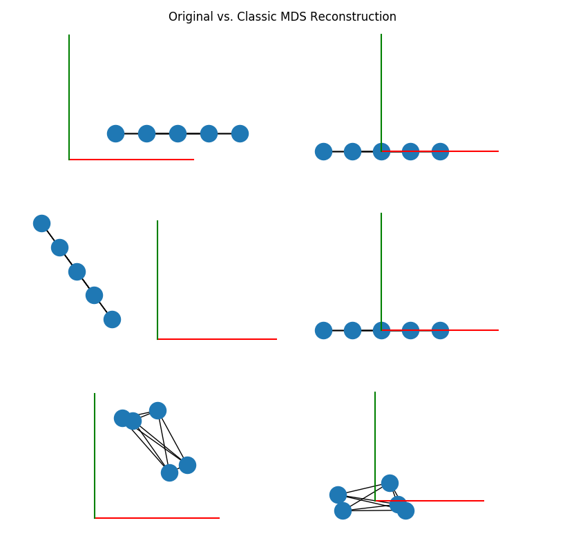

# Euclidean Distance Matrix (EDM) Library

Examples and algorithms implemented from the paper
_Euclidean Distance Matrices: A Short Walk Through Theory, Algorithms and Applications_ by Ivan Dokmanic, Reza Parhizkar, Juri Ranieri, and Martin Vetterli.

## Install
Install dependencies  
```
pip3 install numpy matplotlib networkx
```

## Run
Run the files with python3
```
python3 ex_1_classic_mds.py
```


